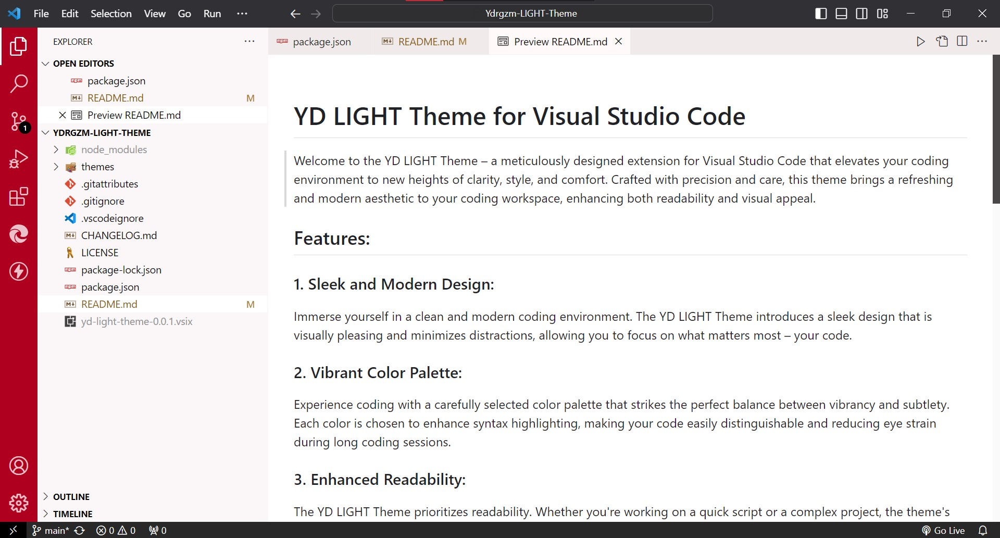

# YD LIGHT Theme for Visual Studio Code

Welcome to the YD LIGHT Theme – a meticulously designed extension for Visual Studio Code that elevates your coding environment to new heights of clarity, style, and comfort. Crafted with precision and care, this theme brings a refreshing and modern aesthetic to your coding workspace, enhancing both readability and visual appeal.

## Features:

### 1. **Sleek and Modern Design:**
   Immerse yourself in a clean and modern coding environment. The YD LIGHT Theme introduces a sleek design that is visually pleasing and minimizes distractions, allowing you to focus on what matters most – your code.

### 2. **Vibrant Color Palette:**
   Experience coding with a carefully selected color palette that strikes the perfect balance between vibrancy and subtlety. Each color is chosen to enhance syntax highlighting, making your code easily distinguishable and reducing eye strain during long coding sessions.

### 3. **Enhanced Readability:**
   The YD LIGHT Theme prioritizes readability. Whether you're working on a quick script or a complex project, the theme's thoughtful design ensures that your code remains clear and easy to understand.

### 4. **Reduced Eye Strain:**
   With a focus on providing a comfortable coding experience, this theme aims to minimize eye strain. The combination of background colors and syntax highlighting creates a well-balanced visual environment, promoting extended coding sessions without fatigue.

### 5. **Customizable Options:**
   Tailor the theme to suit your preferences. The YD LIGHT Theme offers customizable options, allowing you to tweak the theme to align with your coding style and preferences.

## Installation:

1. Launch Visual Studio Code.
2. Go to Extensions in the Activity Bar (`Ctrl+Shift+X`).
3. Search for "YD LIGHT Theme" and click Install.

## Feedback and Contributions:

We value your feedback! If you have suggestions, issues, or improvements, please feel free to open an issue or submit a pull request on our [GitHub repository](https://github.com/YD/YD-LIGHT-Theme).

Elevate your coding experience with the YD LIGHT Theme – where aesthetics meet functionality, and coding becomes an enjoyable journey. Happy coding! 🚀
